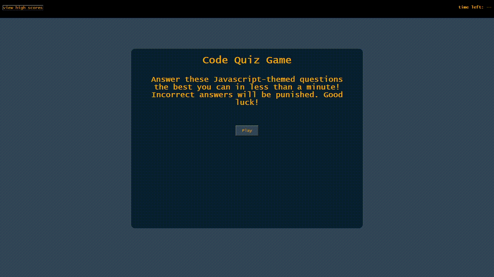

# code-quiz

[See the deployment](https://gulpinhenry.github.io/code-quiz/)

 
---

## Table of Contents

- [code-quiz](#code-quiz)
  - [Table of Contents](#table-of-contents)
  - [About the Project](#about-the-project)
  - [Technologies](#technologies)
  - [Usage](#usage)
  - [License](#license)
  - [Questions](#questions)

## About the Project
 A mini JavaScript-themed quiz designed to experiment with utilizing Web APIs in JavaScript to apply in HTML and CSS. In this project I learn to traverse the DOM and make changes to HTML and CSS using JavaScript.

 

## Technologies
  * [HTML](https://developer.mozilla.org/en-US/docs/Web/HTML)
  * [CSS](https://developer.mozilla.org/en-US/docs/Web/CSS)
  * [JavaScript](https://developer.mozilla.org/en-US/docs/Web/JavaScript)

## Usage

The user attempts to answer all the questions accurately and quickly in the span of 1 minute. Scores are saved on a leaderboard,
which is ranked by least time needed to finish the quiz. Inaccurate answers are penalized by subtracting time from the remaining time left. 

## License

This application is covered under the MIT license

## Questions

For any questions, please reach out by creating an issue.

Developer's Repos   
[Henry Kam](https://github.com/gulpinhenry)
